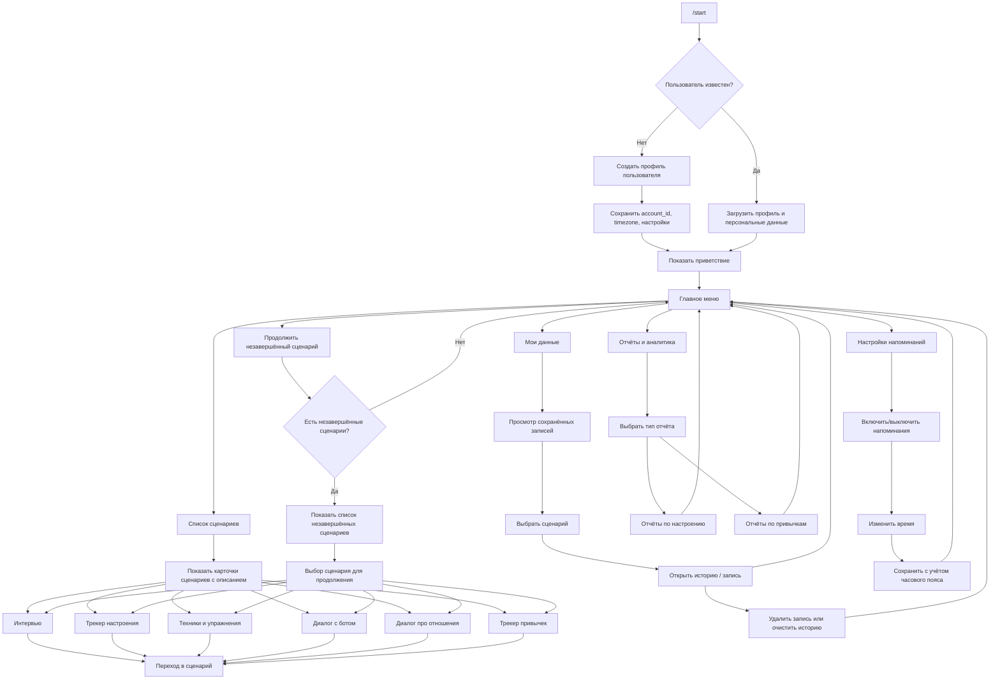
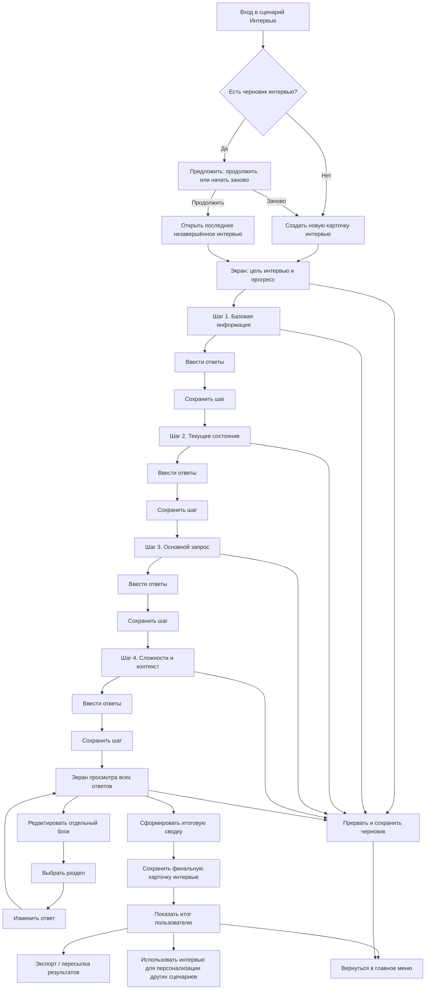
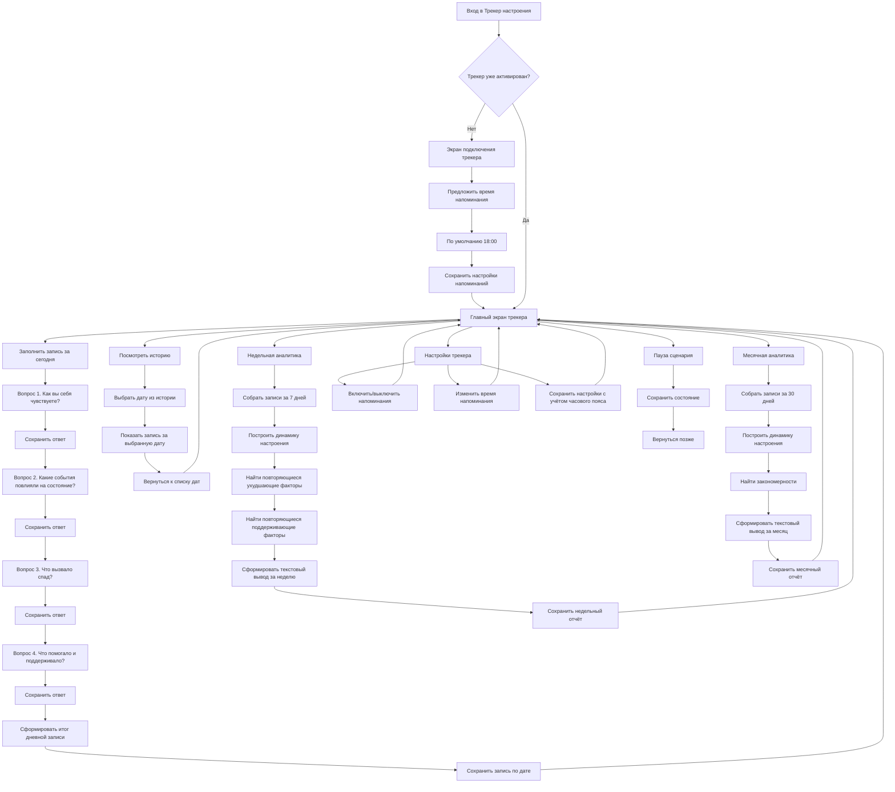
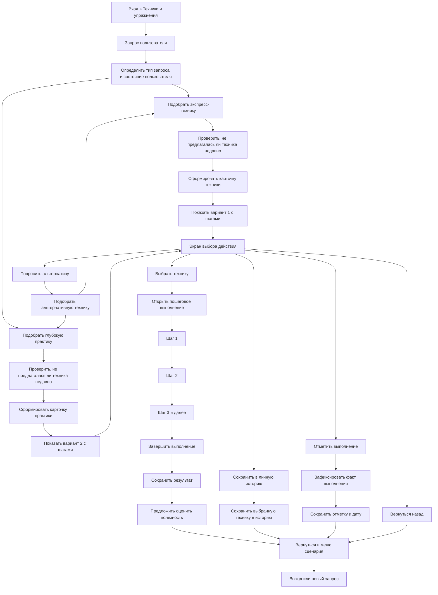
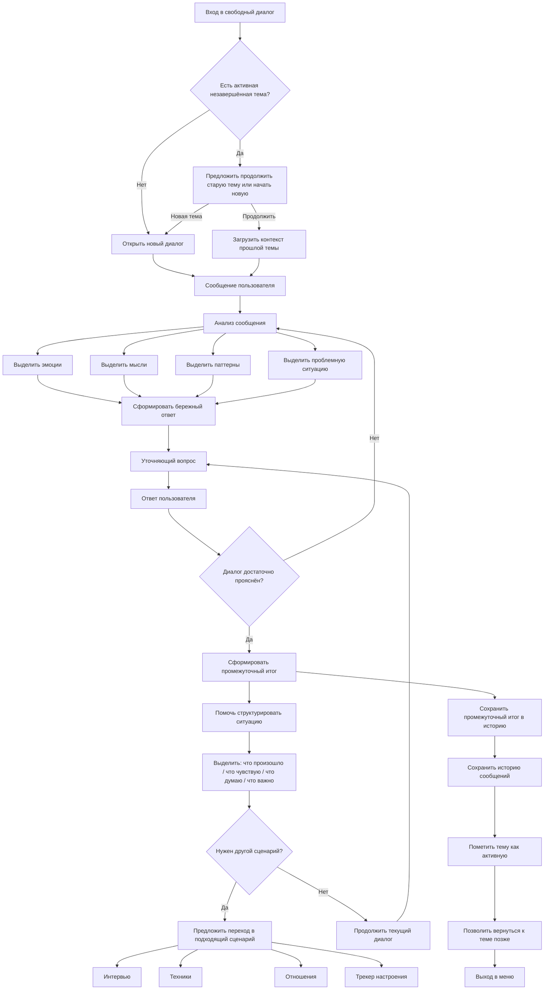
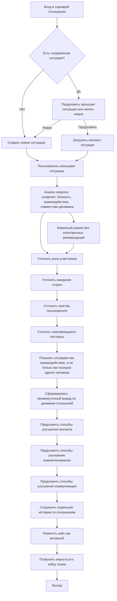
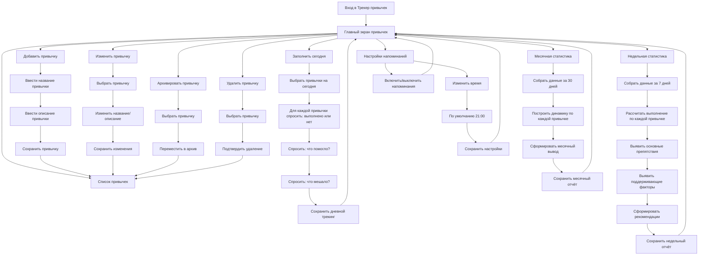
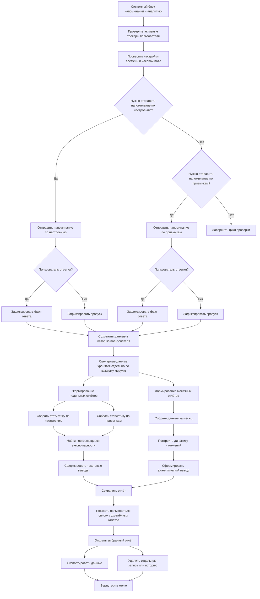

Да, согласен — прошлые схемы получились слишком укрупнёнными и потеряли **логику диалога**, ветвления и состояние данных.

Ниже переписываю **все 8 схем** уже как более полноценные **диалоговые флоу для aiogram-dialog**:
с входом, окнами, действиями пользователя, сохранением данных, возвратом, настройками и переходами между сценариями. Основано на ваших требованиях. 

---

# 1. Главное меню и навигация

---

# 2. Сценарий «Интервью»

---

# 3. Сценарий «Трекер настроения»

---

# 4. Сценарий «Техники и упражнения»

---

# 5. Сценарий «Диалог с ботом»

---

# 6. Сценарий «Диалог про отношения»

---

# 7. Сценарий «Трекер привычек»

---

# 8. Напоминания, уведомления, аналитика и данные

---

Если хочешь, я могу следующим сообщением сделать ещё более полезную версию:
**не просто Mermaid, а разложение по aiogram-dialog сущностям**:

* `StatesGroup`
* `Window`
* `getter`
* `on_click`
* `switch_to/start/back/next`
* какие данные хранятся в `dialog_data` / `start_data` / БД

Это уже будет почти проектная спецификация для разработчика.
